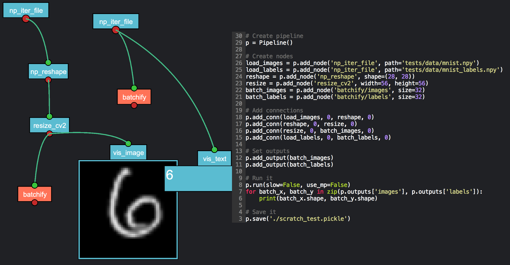

# VisPipe
## Build Pipelines visually and run them via code
[](https://www.codefactor.io/repository/github/junkybyte/vispipe/overview/master)




VisPipe is a python package that can help you build pipelines by providing a convenient visual creation tool that can simplify the construction and debugging of otherwise blackbox pipelines.
Once you are satisfied with the result a pipeline can be saved to file and run via code, the outputs of it can be easily interacted with through python code.

By default VisPipe provides a number of Operational blocks, you are encouraged to extend them by creating your own.
VisPipe will run using python `Threads` or `Process` (+ `Queues`) internally to reduce the tradeoff between performance and flexibility.
Each block of your pipeline will support multiple input/output arguments, multiple connections and custom static arguments.

## Installation
```
git clone https://github.com/JunkyByte/vispipe.git
pip install vispipe
```

## [Usage](docs/docs_md/usage.md)
## [Visualization](docs/docs_md/visualization.md)
